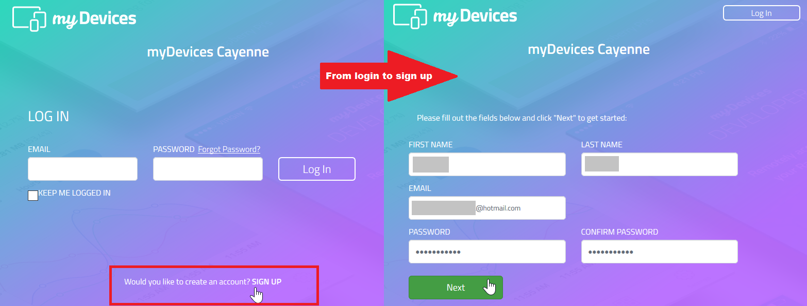
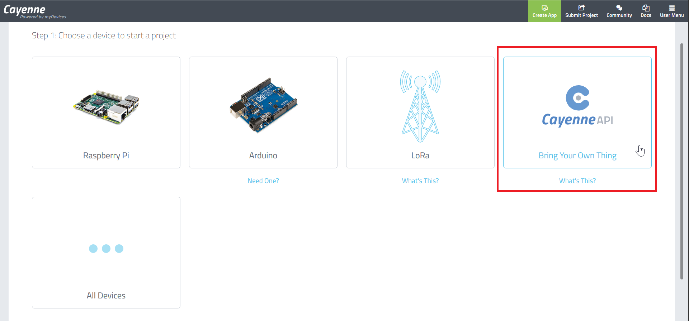
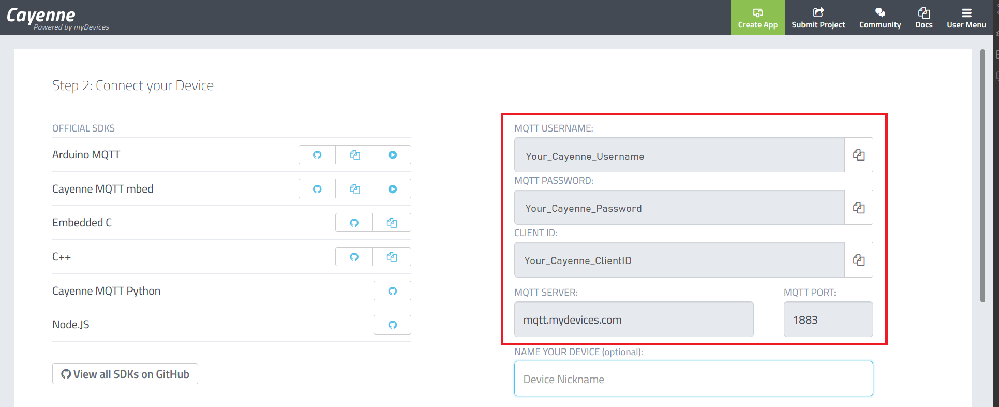

# XDK-Workspace MITA: Cayenne

This repository only storages an example of sending data over WiFi and
using the MQTT protocol to the IoT Cayenne platform.

MITA is a excellent programming lenguage to use when learning XDK and 
rapid prototyping processes on hackathones and courses.

`The MITA code has been tested only on XDK Workbench v.3.6.1 and
Windows 64-bits`

## General requirements

1. XDK-Workbench v3.6.1 installed, download the installer in the
[Bosch developer portal](https://developer.bosch.com/web/xdk/downloads)
and choose your operating system and architecture.

   >If "Your_User" name has spaces or special characters on the
   suggested installation path like C:\Users\Your Usér\XDK-Workbench
   the projects would not build. Avoid that issue installing the XDK
   Workbench on a directory with no spaces or special characters path
   as C:\Users\XDK-Workbench or C:\XDK-Workbench.

2. XDK device with bootloader v0.0.9 or v1.2.0.
   
   >The bootloader v1.2.0 sometimes shows errors at flashing the
   device, to solve this issue only re-build the current project and
   try to flash again the device.

3. A Cayenne IoT platform account.

## Setup Cayenne IoT Platform

Before goes to MITA code on the XDK Workbench you must setup the Cayenne
platform, the objective is to get the required credentials and server
identifiers.

1. Access to [myDevices Cayenne portal](https://cayenne.mydevices.com/)
and select **SIGN UP** as showed in the image bellow and fill the
requested information.

2. After the sign up, the page automatically will open the setup page on
**Step 1** and select **CayenneAPI** option. If it does not happen, try
to reload the [login page](https://cayenne.mydevices.com/) and login
using your new credentials, the page is the same as the first image
showed above.

   >Check if a confirmation email was sent to your email account to
   verify your new Cayenne account.

3. Cayenne platform will redirect you to **Step 2**, where you will find
the required credentials and server identifiers. 

   >The *MQTT server* and *MQTT port* usually stay as the same on all
   the Cayenne accounts, so this information is already loaded into the
   MITA script, the changes on MITA script requires only the
   *MQTT username*, the *MQTT password* and the *Client ID*. They are
   unique to every account and every project created by the same
   account.

#### Get the projects using GIT

* To use the modules and projects of repository, clone the current repository into your **XDK-Workspace** folder, usually, the path follows the same pattern on Windows like *`C:\Users\Your_User\XDK-Workspace`* or *`C:\Your_user\XDK-Workspace`* (be careful, not confused with the installation folder, its pattern follows the structure *`C:\XDK-Workbench`*), use the next command:

     * `git clone https://github.com/rgonzalezc1811/XDK-MITA-Cayenne.git` 
  
#### Get the projects using the ZIP download

* Download the master branch *`master`* as a ZIP file.
* Unzip the file into the **XDK-Workspace** folder, usually, the path follows the same pattern on Windows like *`C:\Users\User\XDK-Workspace`* or *`C:\User\XDK-Workspace`* (be careful, not confused with the installation folder, its pattern follows the structure *`C:\XDK-Workbench`*)

#### Use a project

* Open your **XDK-Workbench**.
* Close the *Welcome* page.
* Go to *File* > *Open Projects from File System...*
* On the *Import Projects from File System or Archive* window click on *Directory...*
* Go to the *XDK-Workspace*
* In the *Browse for Folder* window, select the desired project on MITA (ble, sdcard and so on) and click on *OK*.
* On the *Import Projects from File System or Archive* window click on *Finish*
* Do right click on the MITA project main folder and go to *Properties*.
* Select *C/C++ Build*.
* Click on *Behavior*.
* Click in *Enable parallel build*.
* Select *Use optimal jobs (#)*, that option has the better performance.
* Select the root project folder and right click.
* Select *Build Project*
* When building is finished, go to **XDK Devices** and click in *Flash* 

##### Use a project by copying only the *application.mita* file

* Open your **XDK-Workbench**.
* Close the *Welcome* page.
* Create a new *MITA project* in the **XDK-Workbench**
    1. Go to *File* >  *New* > *Project...*
    2. Select *XDK* > *Eclipse Mita project* and click on *Next >*
    3. Name it as the current MITA project to copy in the text box *Project name:*
    4. Click on *Finish*
* Browse to the desired project in the remote repository.
* Copy the text of the *application.mita* file
* Paste the text into your *application.mita* generated in the local MITA project.
* Do right click on the MITA project main folder and go to *Properties*.
* Select *C/C++ Build*.
* Click on *Behavior*.
* Click in *Enable parallel build*.
* Select *Use optimal jobs (#)*, that option has the better performance.
* Select the root project folder and right click.
* Select *Build Project*
* When building is finished, go to **XDK Devices** and click in *Flash*

## Version notes v.1.1.0

* Bootloader v.0.0.9 has better performance than v.1.2.0, try to use always the previous version.

* Avoid using spaces or special characters on the instalation path, the XDK-Workspace path or new project names.

* Some WiFi codes are not working in some XDK hardware, some of the causes are still unknown.

## Project status

The project is a own work to have all the XDK base codes for events, hack developments and rapid prototyping.